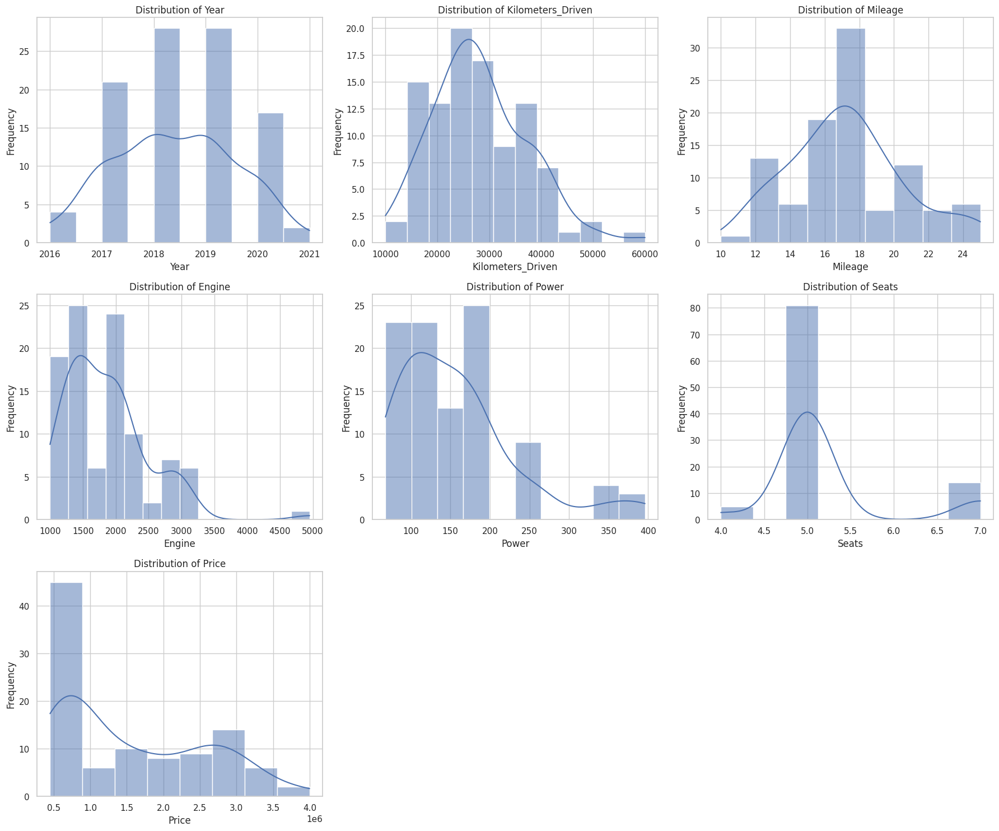
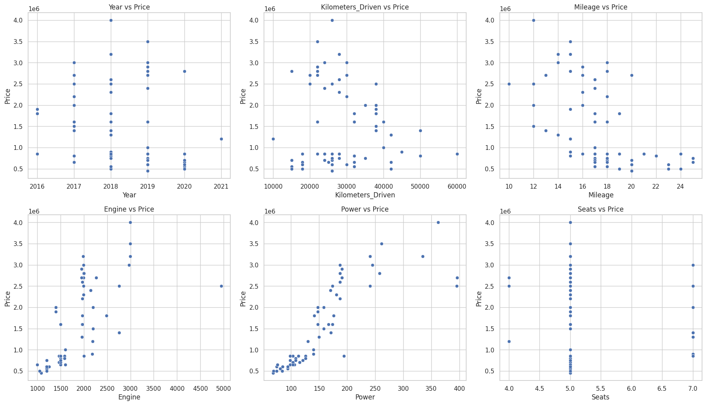

# Second-Hand-Car-Price-Prediction
## Car Price Prediction using Multiple Linear Regression

## Description
This repository contains a dataset and corresponding analysis to predict car prices based on various car features using multiple linear regression models. The analysis includes a custom-built multiple linear regression model from scratch and a comparison with scikit-learn's linear regression model.

## Dataset
The dataset contains the following features:
1. `Car_ID`: A unique identifier for each car listing.
2. `Brand`: The brand or manufacturer of the car (e.g., Toyota, Honda, Ford, etc.).
3. `Model`: The model of the car (e.g., Camry, Civic, Mustang, etc.).
4. `Year`: The manufacturing year of the car.
5. `Kilometers_Driven`: The total kilometers driven by the car.
6. `Fuel_Type`: The type of fuel used by the car (e.g., Petrol, Diesel, Electric, etc.).
7. `Transmission`: The transmission type of the car (e.g., Manual, Automatic).
8. `Owner_Type`: The number of previous owners of the car (e.g., First, Second, Third).
9. `Mileage`: The fuel efficiency of the car in kilometers per liter.
10. `Engine`: The engine capacity of the car in CC (Cubic Centimeters).
11. `Power`: The maximum power output of the car in bhp (Brake Horsepower).
12. `Seats`: The number of seats available in the car.
13. `Price`: The selling price of the car in INR (Indian Rupees), which is the target variable to predict.

## Files
- `cars.csv`: The dataset file containing car features and prices.
- `multiple_linear_regression_from_scratch.ipynb`: Jupyter Notebook implementing a multiple linear regression model from scratch and comparing it to scikit-learn's linear regression model.

### Exploratory Data Analysis (EDA)

1. **Summary Statistics**:
   - The dataset consists of 100 entries and 13 columns.
   - The features include a mix of categorical (e.g., Brand, Fuel_Type, Transmission) and numerical variables (e.g., Year, Kilometers_Driven, Price).

2. **Missing Values**:
   - No missing values in the dataset.

3. **Distribution of Numerical Features**:
   - Year: Ranges from 2016 to 2021.
   - Kilometers_Driven: Ranges from 10,000 to 60,000 km.
   - Mileage: Ranges from 10 to 25 km/l.
   - Engine: Ranges from 999 to 4951 CC.
   - Power: Ranges from 68 to 396 bhp.
   - Seats: Ranges from 4 to 7 seats.
   - Price: Ranges from 450,000 to 4,000,000 INR.

4. **Categorical Feature Analysis**:
   - Brand: Includes various car brands like Toyota, Honda, Ford, etc.
   - Fuel_Type: Includes Petrol, Diesel, Electric.
   - Transmission: Includes Manual, Automatic.
   - Owner_Type: Includes First, Second, Third.
   
5. **Feature Analysis with Price**:
   - Power and engine have a direct linear relation with Price.
   - Kilometers driven have an inverse linear relation with Price
   - Interesting observation is that overtime,there are more cars produced which are cheaper and more affordable.
 

